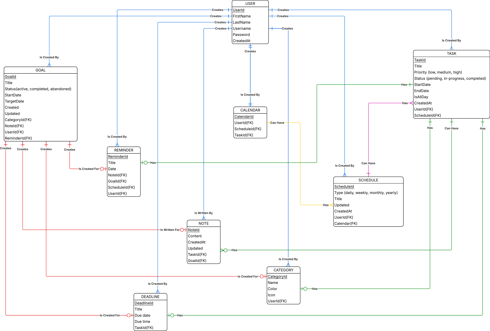

# PlanHub
PlanHub is an application built to empower users in managing their tasks, schedules, and long-term goals. Designed with a broad user base in mind: from those managing busy schedules to individuals seeking greater structure in their routines, the application prioritizes accessibility and ease of use.

The core functions include task creation, editing, deadline management, and schedule visualization.

The application is further enhanced by providing features such as automated reminders, note-taking, and progress tracking.

##### PlanHub Business Rules

A USER can create any number of GOALs. A GOAL is created by exactly one USER.
   
A USER can create any number of TASKs. A TASK is created by exactly one USER.
   
A USER can create any number of REMINDERs. A REMINDER is created by exactly one USER.

A USER can create any number of DEADLINEs. A DEADLINE is created by exactly one USER.

A USER can create any number of NOTEs. A NOTE is written by exactly one USER.

A USER can create any number of CATEGORYs. A CATEGORY is created by exactly one USER.

A USER can create any number of SCHEDULEs. A SCHEDULE is created by exactly one USER.

A USER can create one CALENDAR. A CALENDAR is created by exactly one USER.

A GOAL may have one CATEGORY. A CATEGORY is created for exactly one GOAL.

A GOAL may have one NOTE. A NOTE is written for exactly one GOAL.

A GOAL may have one DEADLINE. A DEADLINE is created for exactly one GOAL.

A GOAL may have one REMINDER. A REMINDER is created for exactly one GOAL.

A CALENDAR can have any number of SCHEDULEs. A SCHEDULE can have exactly one CALENDAR.

A SCHEDULE can have many TASKs. A TASK can have exactly one SCHEDULE.

A TASK may have one REMINDER. A REMINDER can have exactly one TASK.

A TASK may have any number of NOTEs. A NOTE can have exactly one TASK.

A TASK may have one CATEGORY. A CATEGORY can have exactly one TASK.

A TASK may have one DEADLINE. A DEADLINE can have exactly one DEADLINE.
